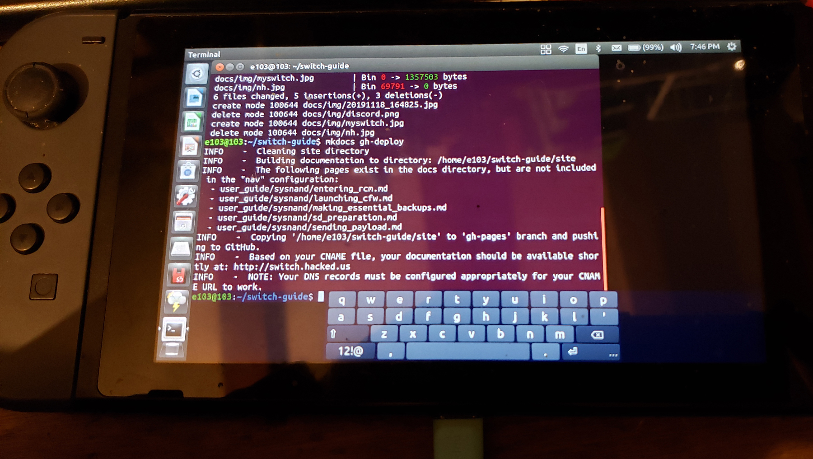

# About this guide

I want to be clear that I did improved and modified the Nintendo Homebrew's guide and I am giving credit and thanks to those people listed here.    
I forked [this guide](https://switchgui.de) and modified it to make it more simpler, less steps, and have more extra guides for common things done on Switch CFW.   
I used my Nintendo Switch to modify this guide :)   

!!! tip ""
    

Thank you very much to those people below here.  

ELY M.    

&nbsp;

The original guide at [https://switchgui.de](https://switchgui.de)
This guide was written by staff members of the [Nintendo Homebrew Discord Server](https://discord.gg/C29hYvh) 

&nbsp;

!!! tip "Credits"
    **SciresM, TuxSH, hexkyz, fincs, Flump, jerbear64, Phoenix, xGhostBoyx, Such Meme Many Skill, PhazonicRidley, emmo, dennthecafebabe, Dax and oreo639.**

    Thank you to [everyone else](https://github.com/nh-server/switch-guide/graphs/contributors) that contributed to the guide on GitHub, but special thanks to **noirscape**.

!!! tip ""
    [You can find this guide on GitHub](https://github.com/nh-server/switch-guide), It is licensed under the [ISC license.](https://github.com/nh-server/switch-guide/blob/master/LICENSE.md)

!!! tip "Developer / Tool credits"
    - **ReSwitched** for some of texts in the guides [ReSwitched discord]()
    - **Atmosphere-NX** for [Atmosphere](https://github.com/Atmosphere-NX/Atmosphere).
    - **switchbrew** for [nx-hbloader](https://github.com/switchbrew/nx-hbloader) and [nx-hbmenu](https://github.com/switchbrew/nx-hbmenu).
    - **nwert** and **CTCaer** for [Hekate](https://github.com/CTCaer/hekate).
    - **WerWolv** for [EdiZon](https://github.com/WerWolv/EdiZon/releases).
    - **J-D-K** for [JKSV](https://github.com/J-D-K/JKSV).
    - **Flagbrew** for [Checkpoint](https://github.com/FlagBrew/Checkpoint).
    - **mtheall** for [FTPD](https://github.com/mtheall/ftpd/).
    - **joel16** for [NX-Shell](https://github.com/joel16/NX-Shell).
    - **Cease & DeSwitch** for [fusee-gelee](https://github.com/Qyriad/fusee-launcher).
    - **MenosGrante** for [Rekado](https://github.com/MenosGrante/Rekado).
    - **eliboa** for [TegraRcmGUI](https://github.com/eliboa/TegraRcmGUI).
    - **vgmoose**, **pwsincd**, **rw-r-r_0644** and **crc32** for [hb-appstore](https://github.com/vgmoose/hb-appstore).
    - **exelix** for [NXThemes Installer and SwitchThemeInjector](https://github.com/exelix11/SwitchThemeInjector).
    - **Essometer** for collecting patched Switch serials.
    - **shchmue** for [Lockpick](https://github.com/shchmue/Lockpick/releases) and [Lockpick_RCM](https://github.com/shchmue/Lockpick_RCM/releases).
    - **Ave** for [90DNS](https://gitlab.com/a/90dns).
    - **Nexrem (meganukebmp)** for the [Switch 90DNS Tester](https://github.com/meganukebmp/Switch_90DNS_tester).
    - **exelix11** for [Switch Theme Injector](https://github.com/exelix11/SwitchThemeInjector/releases).
    - **vgmoose** for [hb-appstore](https://github.com/vgmoose/hb-appstore).
    - **suchmememanyskill** for [TegraExplorer](https://github.com/suchmememanyskill/TegraExplorer)
	- **noahc3, Team AtlasNX** for some of texts and ideas from [The Ultimate Noob Guide for Hacking your Nintendo Switch](https://switch.homebrew.guide/index) 
	- **XorTroll** for [Goldleaf](https://github.com/XorTroll/Goldleaf)  
	- **huntereb** for [Awoo-Installer](https://github.com/Huntereb/Awoo-Installer)
	- **developersu** for [ns-usbloader](https://github.com/developersu/ns-usbloader)
	- **Joonie86** for [Sigpatches](https://github.com/Joonie86/hekate/releases/tag/5.0.0J)
	- **spacemeowx2** for [Lan-play](https://www.lan-play.com)

