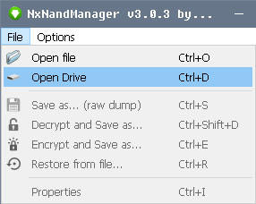
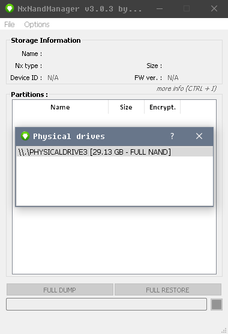
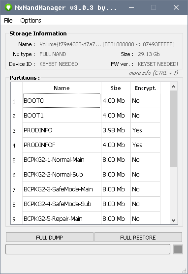
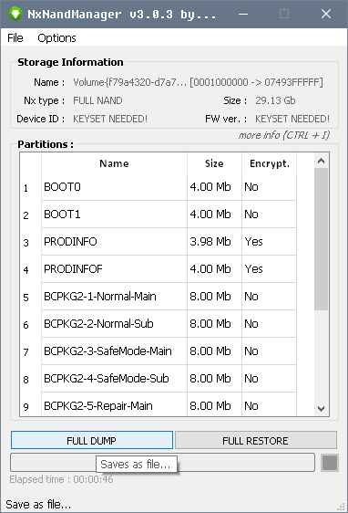
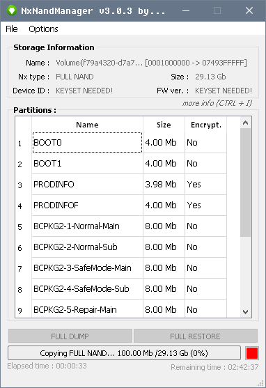

## Backing up your emuMMC partition on your sd card

I know some people want to backup emuMMC.    
This is method will work on windows pcs.       

### What you need:
- The <a href="https://github.com/eliboa/NxNandManager/releases/" target="_blank">NxNandManager</a>
- Your sd card with emuMMC partition

### Instructions:

1. download 'NxNandManager_v<version>_x64.zip' from <a href="https://github.com/eliboa/NxNandManager/releases/" target="_blank">https://github.com/eliboa/NxNandManager/releases/</a>
2. unzip to your place on your pc.  
3. put your sd card in your pc  
4. open the NxNandManager and click on Open Drive.  
   
5. let it scan drives, when it is done scanning, you should see your sd card partition like this below   
   
6.  Select the drive and it will open like this.   
   
7.  Go to file and select save as raw dump.  
   
8.  It will ask you to save to a place on your pc drive or external hdd.         
  
9. it will be 2 to 3 hours for it to finish dumping/saving  

## Restoring your emuMMC partition to your sd card

Not done yet.....

