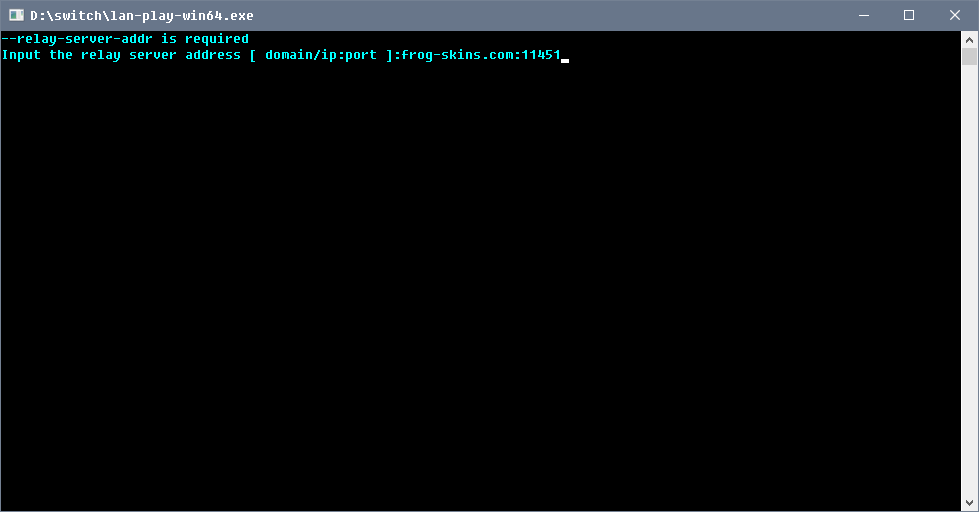
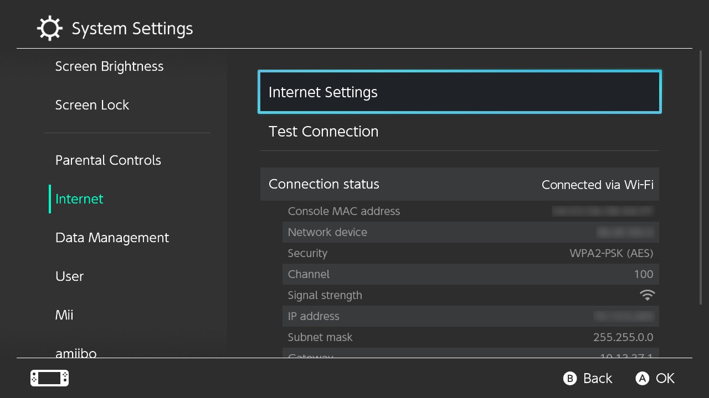

# setting up lan-play to trade with hacked switches or anyone use lan-play  

this guide is based from [install page on lan-play.com](https://www.lan-play.com/install)

first you need to download the Ncap from this url [https://nmap.org/npcap/#download](https://nmap.org/npcap/#download)  get `Npcap #.#### installer`     
install it on your computer.   

get the client for pc from [https://www.lan-play.com/download](https://www.lan-play.com/download)  
put the client exe in a place that you will know where.   
  
open the `lan-play-win64.exe` or `lan-play-win32.exe` depends which exe you downloaded.   
  
it will ask for the server listed at [lan-play.com](https://lan-play.com)   
you and your friends have to be on same server.   
   
   

   
   
Go to your switch and go in your system settings and go to your internet settings.  
   
You need to manually edit the configuration of your local network with this informations.  
Note: The IP address can be any from 10.13.0.1 to 10.13.255.254, excepting 10.13.37.1. But don't use the same IP address with your friend.  
pick really random last two numbers for ip like  10.13.78.33  only 1 to 255     everyone on server need to have different ip address.  
for example,  you are using 10.13.53.30, you need to tell your friend to use 10.13.53.31     
   
IP Address Settings  
IP Address: 10.13.XX.YY  
Subnet Mask: 255.255.0.0  
Gatewway: 10.13.37.1  
   
DNS settings  
Primary DNS: 163.172.141.219   
Secondary DNS: 45.248.48.62  
   
Please follow the screenshots:
   
   
   
   
  
  
  
reconnect to your network to make sure you are using lan-play   
The games have different settings for lan-play  
   
I will use Pokemon Sword game as a example.   
hit X then go to the options and press both R and L and press on your left joystick.  
It should show up the dialog that the game is in LAN mode.  hit A and go back to the game.  
you should start seeing people in Y and on your game screen.   

# Returning to normal wifi  

you just have to change the IP settings to Automatic to use normal wifi.   
the lan-play IP settings will be saved for later use.    

  
  

