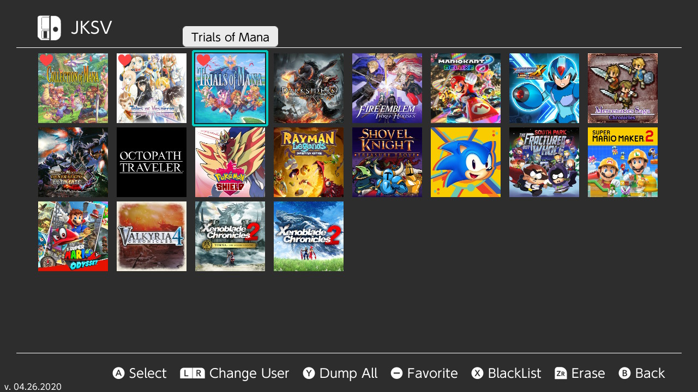

# Save Management

For save management,  [JKSV](https://github.com/J-D-K/JKSV) is recommended. It can be used to back up and restore game saves to your SD card. It also has the ability to edit saves for extra items etc. 
JKSV have support for saves from Animal Crossing New Horizons, Thats why I am recommending JKSV over any other save management apps now.   &nbsp;
### JKSV 
Please read JKSV's [homepage](https://github.com/J-D-K/JKSV) for information on how to use it.

!!! tip ""
	
	
	
	
