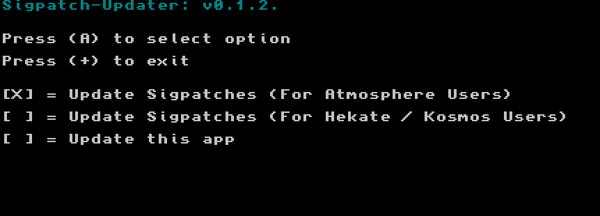

# SigPatches   

!!! warning "Sigpatches are not supported by ReSwitched, Atmosphere and NH devs so do not ask them about sigpatches!"
	Using ES or FS patches are not supported by Atmosphere or Kosmos and never will be. Please use Google to answer any questions regarding this.
	It is in their rules that it is not allowed to talk about installing nsps on their discord servers.  

&nbsp;

## What are sigpatches?
Sigpatches allow your Switch to install and run unofficial NSP files (digital titles that appear on the home menu).   
Note that you must use CFW to launch these applications even after installation as sigpatches are always required to do so.

&nbsp;

I know some users do need them to install homebrew nsps to their switches in their emunand.     
for example, I made hbmenu nsp and installed hbmenu to my home screen for easy access to full ram.      

# Installing SigPatches 

<!--
There are two methods to install Sigpatches now.  

Method #1  
1. download 'sigpatch-updater.nro' from [https://github.com/ITotalJustice/sigpatch-updater/releases](https://github.com/ITotalJustice/sigpatch-updater/releases)   
2. make folder sigpatch-updater in switch folder on your sd card  
3. put 'sigpatch-updater.nro' in sigpatch-updater folder in switch folder   
4. make sure you select the top option for atmosphere users  
4. open it in your hbmenu. press A to install the sigpatches  
5. press + to exit the sigpatch-updater  
6. use reboot to payload to reboot atmosphere  

&nbsp;

&nbsp;

Method #2  

-->  

&nbsp;

1. download <a href=https://gbatemp.net/threads/i-heard-that-you-guys-need-some-sweet-patches-for-atmosphere.521164/>Sigpatches from here</a> and extract to the root of your sd card.  
2. use reboot to payload to reboot atmosphere

       
&nbsp;
