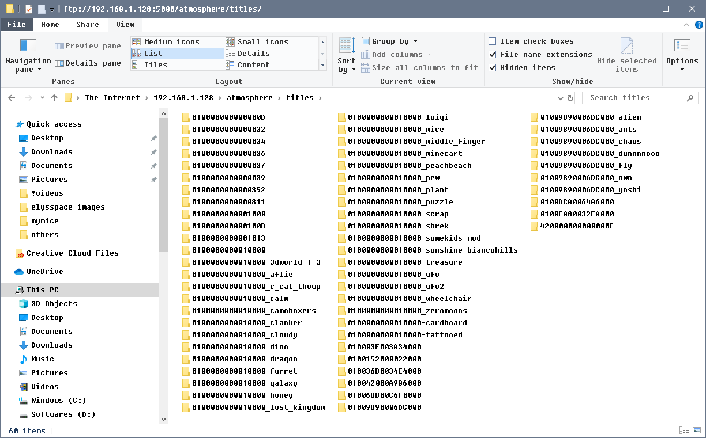

# Keeping your system up-to-date

This page documents how you can keep your system up-to-date.

After following our guide, your system will consist of three core elements that can be updated. Atmosphere, Hekate and your system firmware.

## Updating Atmosphere

When updating Atmosphere always make sure to _read the release notes_. They may list important changes and modifications to your system.

### Manual method: SD card

When a new version of Atmosphere releases, you can always update Atmosphere by following these steps:

1. Turn off your Nintendo Switch and plug your SD card in your computer.
2. Download the latest release of <a href="https://github.com/Atmosphere-NX/Atmosphere/releases" target="_blank">Atmosphere</a> (Download the `atmosphere-(version).zip` release of Atmosphere.)
3. Copy *the contents of* the Atmosphere `.zip` file to the root of your SD card.
    - If you are prompted to overwrite files, do so, _except_ for the `.ini` files.
    - If you do accidentally overwrite the `.ini` files, this is not an emergency but you will lose any changes you made to Atmospheres settings.
4. Put your SD card back in your Switch and launch CFW.

### FTP method: FTP access to your sd card.  

I prefer this method because I try to avoid pulling out sd card unnecessarily.   
you should have the ftpd app in your hbmenu if you followed the guide.   

1. Open the Homebrew menu
2. Open `ftpd`.
3. Note the switch ip and port on your switch screen.  
4. go on your pc and open windows explorer or ftp client.
5. type in switch ip and ftp port (5000) in the address bar and press enter.
6. The explorer should open up your sd card centents.  Make sure you are in the root of your sd card in the window.   
7. Download the latest release of <a href="https://github.com/Atmosphere-NX/Atmosphere/releases" target="_blank">Atmosphere</a> (Download the `atmosphere-(version).zip` release of Atmosphere.)
8. Copy *the contents of* the Atmosphere `.zip` file to the root of your SD card.
    - If you are prompted to overwrite files, do so, _except_ for the `.ini` files.
    - If you do accidentally overwrite the `.ini` files, this is not an emergency but you will lose any changes you made to Atmospheres settings.
9. Exit the ftpd by press B two times.  once you go back to hbmenu, tap on reboot to payload to reboot the atmosphere CFW.

you can watch me updating my atmosphere using ftp method.   
<iframe width="560" height="315" src="https://www.youtube.com/embed/fhQiabtZq3I" frameborder="0" allow="accelerometer; autoplay; encrypted-media; gyroscope; picture-in-picture" allowfullscreen></iframe>

### Automated method: atmosphere-updater

It is also possible to update Atmosphere and Hekate through a homebrew utility called `atmosphere-updater`. This utility should be installed if you followed our guide.

If you did not install this utility, you can download it from <a href="https://github.com/ELY3M/atmosphere-updater---modded-by-ELY-M/releases" target="_blank">here.</a>

Updating your Atmosphere and Hekate installation using atmosphere-updater:

1. Open the Homebrew menu
2. Open `Atmosphere-Updater`.
3. Select `Update Atmosphere (ignoring .ini files)`.
4. Press `A` when prompted.
5. Wait for it to complete. 
6. Select `Reboot (reboot to payload)`.
7. Press `A`.

## Updating Atmosphere fusee-primary.bin payload

It is important that you update the fusee-primary.bin payload.  
you can get latest fusee-primary.bin from <a href="https://github.com/Atmosphere-NX/Atmosphere/releases" target="_blank">Atmosphere</a> (Download the `fusee-primary.bin` release of Atmosphere.)
It depends how are you injecting your payloads.   
- tegraguircm: replace fusee-primary.bin in your favorites folder with latest fusee-primary.bin  
- rcmloader: plug your rcmloader in your computer usb port and it should bring up a drive and 
you should replace the payload.bin in atmosphere folder.  it may be named differently.  delete payload.bin then copy fusee-primary.bin and rename it to payload.bin  
- hekate: replace fusee-primary.bin in /bootloader/payloads with latest fusee-primary.bin  (for trinket m0/mod chip users/hekate users)    

 

2. Download the latest release of <a href="https://github.com/Atmosphere-NX/Atmosphere/releases" target="_blank">Atmosphere</a> (Download the `atmosphere-(version).zip` release of Atmosphere.)

## Updating Hekate

When updating Hekate always make sure to _read the release notes_. They may list important changes and modifications to your system.

### Manual method: SD card

When a new version of Hekate releases, you can always update by following these steps:

1. Turn off your Nintendo Switch and plug your SD card in your computer.
2. Download the latest version of <a href="https://github.com/CTCaer/Hekate/releases/" target="_blank">Hekate</a> (Download the `hekate_ctcaer_(version).zip` release of hekate).
3. copy over the `bootloader` folder with the new `bootloader` folder from the hekate zip on your SD card.
4. Put your SD card back in your Switch and launch CFW.

### FTP method: FTP access to your sd card.  

I prefer this method because I try to avoid pulling out sd card unnecessarily.   
you should have the ftpd app in your hbmenu if you followed the guide.   

1. Open the Homebrew menu
2. Open `ftpd`.
3. Note the switch ip and port on your switch screen.  
4. go on your pc and open windows explorer or ftp client.
5. type in switch ip and ftp port (5000) in the address bar and press enter.
6. The explorer should open up your sd card centents.  Make sure you are in the root of your sd card in the window. 
7. Download the latest version of <a href="https://github.com/CTCaer/Hekate/releases/" target="_blank">Hekate</a> (Download the `hekate_ctcaer_(version).zip` release of hekate).
8. copy over the `bootloader` folder with the new `bootloader` folder from the hekate zip on your SD card.

### Automated method: atmosphere-updater

It is also possible to update Atmosphere and Hekate through a homebrew utility called `atmosphere-updater`. This utility should be installed if you followed our guide. 

If you did not install this utility, you can download it from <a href="https://github.com/ELY3M/atmosphere-updater---modded-by-ELY-M/releases" target="_blank">here.</a>

Updating your Atmosphere and Hekate installation using atmosphere-updater:

1. Open the Homebrew menu
2. Open `Atmosphere-Updater`.
3. Select `Update Hekate files only`.
4. When asked to update hekate, press `A` (Yes).
5. Wait for it to complete.

## Updating your firmware

Always check _before_ updating your system firmware if the latest version of Atmosphere _as well_ as the latest version of Hekate support the firmware version you are updating towards.

Currently the latest version supported by Atmosphere and Hekate are: **9.2.0**.

In addition, updating to or past some firmwares update the gamecard firmware. Reference the table below for information about these.

| Updating from                        | Updating towards                              | Updates gamecard firmware |
| ------------------------------------ | --------------------------------------------- | ------------------------- |
| Below 4.0.0                          | Below 4.0.0                                   | No                        |
| Below 4.0.0                          | 4.0.0 or above                                | Yes                       |
| On or above 4.0.0, but below 9.0.0   | At least 4.1.0 but below 9.0.0                | No                        |
| On or above 4.0.0, but below 9.0.0   | 9.0.0 or above                                | Yes                       |
| On or above 9.0.0                    | Latest supported Atmosphere & Hekate revision | No                        |

If at least one of the versions you are updating towards also updates the gamecard firmware, you will not be able to downgrade below that version without making the gamecard slot unusable until you update.

Atmosphere (and Hekate) come bundled with patches that automatically disable the gamecard slot if it is detected that the system has an older gamecard firmware that would be updated. If you boot into RCM on each boot (for example by using AutoRCM), this means that the gamecard slot will not be updated and you can downgrade below that version. If this happens, you will not be able to use the gamecard slot as long as you are on the newer firmware.

Otherwise, you can safely update your system firmware through the system settings.

### About emuMMC

sysMMC and emuMMC have separate system firmwares and need to be updated separately.

If you keep your emuMMC offline, you will have to use a gamecard to update your system firmware, synchronize it with another Nintendo Switch or dump an updated firmware from your sysMMC.

## Updating emuMMC by dumping an updated firmware from your sysMMC

!!!warning "Do you have an eMMC backup yet?"
    Please do not start this guide without doing a RAW GPP and a BOOT 0/1 eMMC backup!

    You can learn how to make one [here](../user_guide/sysnand/making_essential_backups.md).

!!!danger "Downgrading"
    This guide is made for updating your emuMMC. It is **not** for downgrading. Downgrading at all, sysMMC or emuMMC, is not recommended and not worth it. Downgrading is also very dangerous and can lead to serious complications even when performed correctly.

### What you will need

!!!tip ""
    - The latest release of <a href="https://github.com/suchmememanyskill/TegraExplorer/releases" target="_blank">TegraExplorer</a>
    - The latest release of <a href="https://switchtools.sshnuke.net" target="_blank">ChoiDujourNX</a>
    - The latest release of <a href="https://github.com/Atmosphere-NX/Atmosphere/releases" target="_blank">Atmosphere</a>

!!!danger ""
    ChoiDujourNX is **not** the same as ChoiDujour. Please make sure you download ChoiDujour**NX**!

### Preparing your SD card

1. Insert your microSD card into your computer.
2. Make a folder inside your `switch` folder called `system updates`.
3. Download `TegraExplorer.bin` and place it somewhere on your PC (A good idea is to put it where you keep all your switch payloads like Hekate).
3. Copy `ChoiDujourNX.nro` to `/switch/system updates` from the `ChoiDujourNX.zip` file.
4. Update Atmosphere and Hekate by using the above guides.
5. If you haven't already, update the sysMMC to the latest firmware.

### Dumping your sysMMC firmware

1. Make sure your sysMMC is up to date. If your sysMMC is not up-to-date, update it through the System Settings.
2. Inject `TegraExplorer.bin` using TegraRCMGUI (Like you would with Hekate).
3. Using the volume and power buttons, select `Tools` and then `Dump Firmware`.
4. Wait about 1-2 minutes for the tool to dump your firmware.
5. When the tool finishes, press any volume button.
6. Select `Reboot to RCM` and inject with fusee-primary.bin) using the volume and power buttons.

### Updating your emuMMC with ChoiDujourNX

1. Boot up atmosphere with fusee-primary.bin payload, if you have not booted up atmosphere. 
2. Once booted, hold `R` while launching a game to boot into the homebrew launcher.
3. Navigate to the `system updates` folder where you should see ChoiDujourNX, launch it.
4. Once in ChoiDujourNX, navigate to `tegraexplorer/Firmware/<latest firmware number>`. In that folder you should see a large number of `.nca` files.
5. Tap on `Choose` in the bottom right hand corner of the screen.
6. When given the option, select your firmware that you have just dumped. If it is available, choose the update with `(Exfat)`.
7. Tap `Select firmware` in the bottom right hand corner of the screen.
8. Tap `Start installation`.
9. Wait until ChoiDujourNX completes installing the dumped firmware.
10. Once it completes, it will ask you if it can reboot. Tap `Reboot`.
11. Once rebooted, launch into emuMMC and verify your system works. You can verify your system has been properly updated in `Settings -> System` on your emuMMC.
