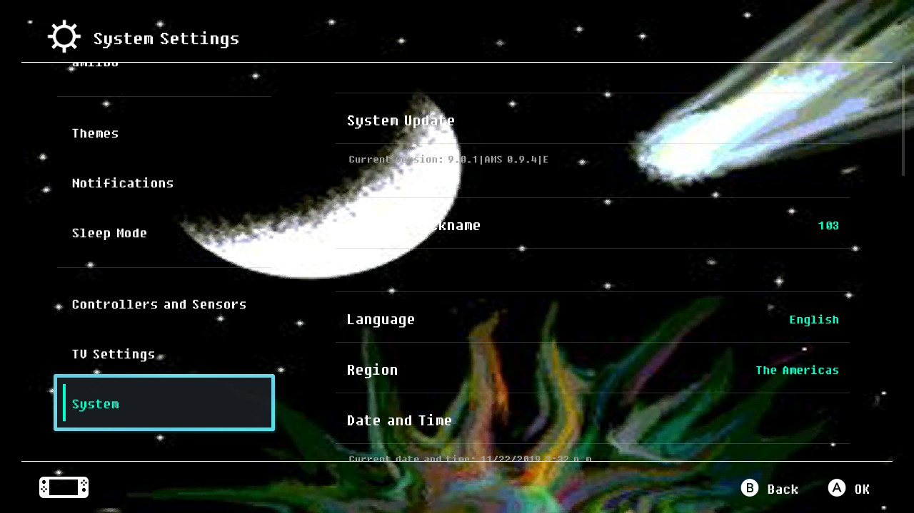

# Launching CFW

Now that the preparation work is out of the way, we're finally ready to launch custom firmware on the Switch.

Unlike systems such as the DSi, Wii, or 3DS, Switch CFW is currently volatile- it will only work as long as your Switch is on. As soon as your Switch completely loses power for any reason (shutting down, battery dying, etc.), CFW will no longer be active and you will need to follow these instructions again.

&nbsp;

!!!danger "Keep emuMMC offline at all times"
    You should keep your emuMMC(emunand) offline (or with 90dns) at all times. Not doing this will likely result in a ban
	
### Instructions

There are several ways to launch atmosphere.  
1. via reboot to payload in hbmenu (for restarting)
2. in Hekate, Tap on payloads and select fuse-primary.bin 
3. in Hekate, Tap on launch and select atmosphere (emuMMC)
3. RCM method - injecting with fuse-primary.bin via payload launcher  

!!! tip ""
    1. if you are still in Hekate. you can tap on "Payloads" button and select fuse-primary.bin to launch atmosphere.  
	if you are not in Hekate anymore or powered off, follow below.  
    1. Power on your Switch into RCM, and inject the fusee-primary.bin payload.
	2. you should see blue screen with sept and it will boot into Atmosphere.

Your Switch is now booting into Atmosphere.

To verify Atmosphere launched properly, open the Settings applet, and navigate to System. You should see `AMS` next to the version number, as well as an `E` at the end, indicating you are booted into emuMMC.

&nbsp;

!!! tip ""
    

&nbsp;

### Launching the Homebrew Menu

You will now be able to launch the Homebrew Menu by opening the album or by holding the R button while launching any game (including demos/cartridges), or application (e.g. Youtube/Hulu). If R is not held, the game or application will launch like normal.
    
!!! warning "A note about using the album for the Homebrew Menu"
    - Using the album for the Homebrew Menu instead of a game or application has several limitations, including but not limited to: a smaller amount of available memory (RAM), as well as being unable to launch a full-featured web browser. It is strongly recommended to launch homebrew through applications or games instead. If your games don't show up as "installed" on your switch, copy the contents of the `Nintendo` folder from the root of the sd card to the `emummc/RAW1/Nintendo` folder
    
!!! tip "Adding new applications"
    - Place homebrew applications (`.nro` files) into the `switch` folder on your SD card.

&nbsp;

### What the included homebrew applications do

!!! tip ""
    - JKSV is a save manager, it can dump and restore saves from/to your system. For more information, see [Save Management](../../extras/save_management.md)

    - FTPD is a ftp tool for connecting your Switch's sd card wirelessly to your pc. Tools like Filezilla can connect to your switch on `(ip of switch):5000`

    - NX-Shell is a file explorer for the Switch. You can move files, listen to mp3's, view images etc.

    - NXThemeInstaller is a theme installer app. See the [Theming section of our guide](../../extras/theming.md) for more information

    - hbappstore is a homebrew app store where a large collection of switch homebrew is kept.
