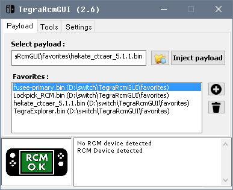
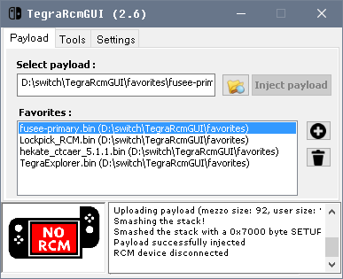

# Sending a Payload

!!! warning "If you are here to test if your Switch is patched"
    Make sure you have [put your device into RCM](../emummc/entering_rcm.md) and downloaded Hekate (if necessary, extract its zip file onto the root of your SD card) before continuing. Once finished, if your console is **not** patched, continue with [SD Preparation](../emummc/sd_preparation.md) instead of `Partitioning SD and Making the emuMMC` at the end of this page.

Now that the device is in RCM, we will need to send it a payload. The methods are mostly the same, but slightly differ depending on what hardware you have available.

&nbsp;

## Windows

### What you need

!!! tip ""
    - The latest release of <a href="https://github.com/ELY3M/TegraRcmGUI---modded-by-ELY-M/releases" target="_blank">TegraRcmGUI</a> (portable zip)
    - A USB-A to USB-C cable (or a standard USB-C cable if your computer natively supports USB-C)

    Payloads you'll need for this guide:

    - The latest release of <a href="https://github.com/CTCaer/hekate/releases/" target="_blank">Hekate</a> (the hekate_ctcaer bin from hekate_ctcaer zip)
	- The latest release of <a href="https://github.com/Atmosphere-NX/Atmosphere/releases" target="_blank">fusee.bin</a> from  <a href="https://github.com/Atmosphere-NX/Atmosphere/releases" target="_blank">Atmosphere</a>

### Instructions

!!! tip ""
    1. Install TegraRcmGUI by unzipping and put the contents in your preferred place on your computer.
	2. TegraRcmGUI came with the payloads in the favorites folder.  We need to make sure we update them with latest payload bins.  
		- copy the latest payload bins into the favorites folder and just say yes to overwrite.   
    3. Navigate to the `Settings` tab, then press `Install Driver` and follow the on-screen instructions.
    4. Connect your Switch in RCM to your PC using the USB cable.
    5. Navigate to the `Payload` tab of TegraRcmGUI.
        - Your Switch should be shown as detected in the bottom left corner.
    6. Press the file button next to `Inject payload`, and navigate to and select your payload `.bin` file.
        - The first time you read this page you should inject hekate_ctcaer bin for partitioning your sd card for emuMMC.
    7. Click `Inject payload` to launch the payload you selected.

&nbsp;

## Mac / Linux

### What you need

!!! tip ""
    - The latest release of <a href="https://github.com/nh-server/fusee-interfacee-tk/releases" target="_blank">fusee-interfacee-tk</a>
    - A USB-A to USB-C cable (or a standard USB-C cable if your computer natively supports USB-C)

    Payloads you'll need for this guide:

    - The latest release of <a href="https://github.com/CTCaer/hekate/releases/" target="_blank">Hekate</a> (the hekate_ctcaer bin from the hekate_ctcaer zip)
	- The latest release of <a href="https://github.com/Atmosphere-NX/Atmosphere/releases" target="_blank">fusee.bin</a> from  <a href="https://github.com/Atmosphere-NX/Atmosphere/releases" target="_blank">Atmosphere</a>
	

### Instructions

!!! tip ""
    1. Download and run the payload injector (if you're on Linux, you will need to run this program as root, use `sudo`, or follow the instructions at [Linux injection without root](../../extras/adding_udev.md)).
    2. Connect your Switch in RCM to your PC using the USB cable.
    3. Wait for your Switch to be shown as found in the injector.
    4. Press `Select Payload`, and navigate to and select your payload `.bin` file.
        - The first time you read this page you should inject hekate_ctcaer bin.
    5. Click `Send Payload!` to launch the payload you selected.

&nbsp;

## Android

### What you need

!!! tip ""
    - The latest release of <a href="https://github.com/ELY3M/NXloader103/releases" target="_blank">NXloader103 by ELY M.</a>
        - You will need to enable Unknown Sources in your device settings to install this
    - A USB-C cable
        - If your device has a USB-C port, you may use a C-C cable
        - If your device only has a Micro USB port, you will need a USB OTG adapter and a USB A-C cable
            - This **will not work** on every phone!

		
### Instructions

!!! tip ""
    1. Launch NXLoader103 on your phone.
    2. Tap on "Get or Update Built-in payloads" button to update payload bins.    
	3. Tap on hekate_ctcaer.bin to set payload bin to be used to send payload.   
    4. Connect your Switch in RCM to your phone using the USB cable
    5. Make sure the text on top is in green and said device is connected.   
	6. If prompted, grant NXLoader103 access to the Switch
    7. Click on Injection to send payload to your Switch. 
        - The first time you read this page you should inject hekate_ctcaer bin for partitioning your sd card for emuMMC.

&nbsp;

## Chromebook

### What you need

!!! tip ""
    - A USB-C cable
    - If your chromebook has a USB-C port, do note that this will not work using a C-C cable.

    Payloads you'll need for this guide:

    - The latest release of <a href="https://github.com/CTCaer/hekate/releases/" target="_blank">Hekate</a> (either the hekate_ctcaer bin or the hekate_ctcaer zip)
    - The latest release of <a href="https://github.com/Atmosphere-NX/Atmosphere/releases" target="_blank">fusee.bin</a> from  <a href="https://github.com/Atmosphere-NX/Atmosphere/releases" target="_blank">Atmosphere</a>

### Instructions
    
!!! tip ""
    1. Go to the injection [website](https://switchgui.de/web-payload/) and scroll all the way down
    2. Select the "Upload Payload" option and upload the hekate_ctcaer `.bin` file from the Hekate `.zip` file.
        - The first time you read this page you should inject hekate_ctcaer bin.
    3. Connect your Switch in RCM to your Chromebook using the USB cable.
    4. Select "Do the thing". A pop up will appear. Click the `APX` option.
    5. Press the Connect button and the payload will be injected.
    
&nbsp;

!!! danger "If nothing happens after you send the payload"
    If your console's screen remains black after you've sent Hekate, it's possible your payload was corrupted, or that your console is patched. If your payload injector program shows that 0 bytes were sent, then it is definitely patched, so you'll be unable to proceed with the rest of the guide.

&nbsp;

#### [Continue to Partitioning the SD and Making the emuMMC<i class="fa fa-arrow-circle-right fa-lg"></i>](partitioning_sd_and_making_emummc.md)
